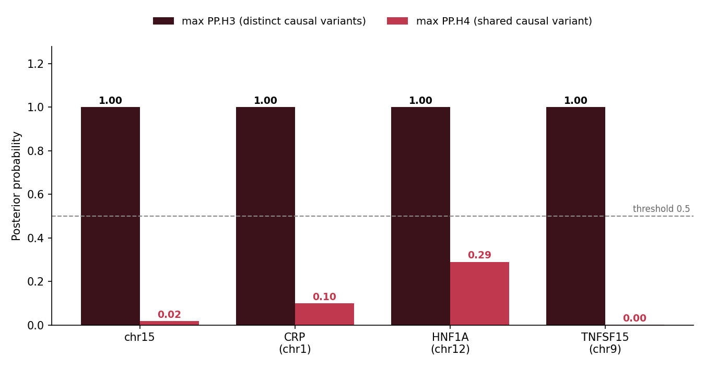
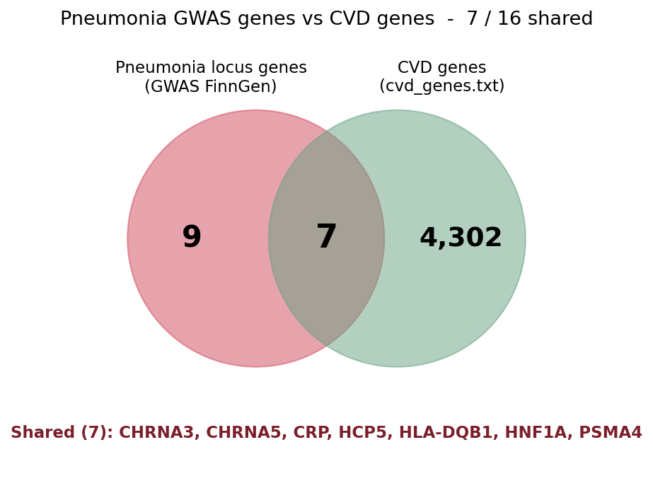
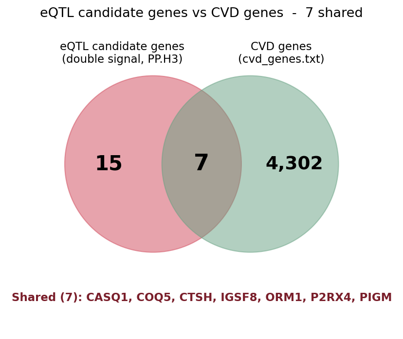

# GWAS–eQTL Colocalization Pipeline — Pneumonia × Cardiovascular Disease

**Do bacterial-infection susceptibility and cardiovascular disease share causal genetic variants?**
A complete colocalization pipeline (FinnGen GWAS × GTEx eQTL) built for a Master's bioinformatics project.

> 🇫🇷 Internal project tracking was done in French; this repository (code, results, docs) is in English.

---

## The question

Epidemiology repeatedly links severe infections to later cardiovascular disease (CVD). Is that shared biology written in the DNA? Specifically: do pneumonia GWAS signals **colocalize** with eQTLs of immune/inflammatory genes, and are those genes CVD genes?

**Logic chain:** pneumonia GWAS signal → colocalizes with a tissue eQTL → implicates a candidate gene → is it in the CVD gene list → biological interpretation.

## Headline result

Across **4 well-powered non-MHC pneumonia loci** and **74 gene×tissue colocalization tests** (blood, lung, liver):

| Finding | Detail |
|---|---|
| **No colocalization** | No test reached PP.H4 > 0.5 (max = 0.29, a lung lncRNA) |
| **PP.H3 ≈ 1 everywhere** | Where both signals exist, they are real but driven by **distinct causal variants** |
| **Gene-level overlap exists** | 7/16 GWAS-locus genes and 7/26 eQTL candidate genes are CVD genes |

**Interpretation:** pneumonia and CVD share loci and genes (including CRP and HNF1A — classic inflammation↔CVD bridges), but the shared architecture sits at the **gene/region level, not the causal-variant level**. PP.H3 ≈ 1 is a valid scientific result, not a failure — confirmed independently across blood, lung AND liver.



## Data

| Source | Details |
|---|---|
| GWAS | [FinnGen DF13](https://www.finngen.fi/en/researchers/clinical-endpoints), endpoint `J10_PNEUMONIA`, European, hg38 — 21.3M variants, 501 genome-wide significant |
| eQTL | GTEx v8 via the [EBI eQTL Catalogue API v2](https://www.ebi.ac.uk/eqtl/api/v2/) — whole blood (QTD000356, n=670), lung (QTD000271, n=510), liver (QTD000266, n=208) |
| CVD gene list | 4,309 unique HGNC symbols (`data/cvd_genes.txt`) |
| Coloc parameters | N=500,186 · 84,364 cases / 415,822 controls (s=0.1687) · type="cc" · GRCh38 throughout (no liftOver needed) |

## Loci tested

| Locus | GWAS hits | Candidate genes (strong eQTL) | Best PP.H4 | Coloc? |
|---|---|---|---|---|
| chr15 (15q25) | 140 | CTSH, IREB2, CIB2, RASGRF1 | ~0.02 | ❌ H3 ≈ 1 |
| chr1 (CRP) | 82 | SLAMF8, IGSF8, COPA, AIM2, MNDA | 0.10 | ❌ H3 ≈ 1 |
| chr12 (HNF1A) | 12 | P2RX4, COQ5, C12orf43 | 0.29 | ❌ H3 ≈ 1 |
| chr9 (TNFSF15) | 11 | TNFSF15, ORM1 | <0.01 | ❌ H3 ≈ 1 |

Not testable / excluded: **chr2 (IFIH1)** — no cis-eQTL; **chr5 (CDH6)** — underpowered; **chr6 (MHC)** — extreme LD.
Liver was added (supervisor decision D3) for CRP and HNF1A: neither lead gene has a cis-eQTL even in liver — the limitation is demonstrated empirically, not assumed.

**Validation:** the pipeline independently recovers HYKK + CHRNA3/5 at 15q25, matching published UKB+FinnGen pneumonia GWAS.

## CVD overlap (Phase 5)

- **View A — GWAS-locus genes ∩ CVD:** 7/16 → CHRNA3, CHRNA5, CRP, HCP5, HLA-DQB1, HNF1A, PSMA4
- **View B — eQTL candidate genes ∩ CVD:** 7/26 → CASQ1, COQ5, CTSH, IGSF8, ORM1, P2RX4, PIGM

<p>
  
  
</p>

The 26 View-B candidates have both GWAS and eQTL signal at their locus (PP.H3) but do not colocalize — region-level, not shared-causal-variant, candidates. Most biologically telling: P2RX4, CTSH, ORM1, IGSF8.

## Pipeline

```
FinnGen GWAS (.gz, 21M variants)
      │  05g_extract_gwas.py     locus slice (chrom-sorted early stop)
      ▼
GWAS locus window ──┐
                    │  06g_harmonize.py     allele alignment + 3 QC checks
EBI eQTL API ───────┤  04g_fetch_eqtl.py    GTEx v8 blood+lung+liver (≤1Mb windows)
                    ▼
            Harmonized per gene×tissue
                    │  08g_coloc.R         coloc.abf (PP.H0–H4), dedup multi-allelic keys
                    ▼
        MASTER_coloc_results.tsv (74 tests)
                    │  10_cvd_overlap.py   ∩ cvd_genes.txt
                    ▼
        Phase 5 overlap tables + Venn diagrams
```

## Repository layout

```
├── scripts/
│   ├── generic/       reusable pipeline (04g, 05g, 06g, 08g + 10_cvd_overlap)
│   ├── chr15/         01→09: the original chr15 pilot (development history)
│   └── diagnostics/   data QC probes
├── results/           coloc TSVs + locus plots per tissue, MASTER table, phase5 tables
├── figures/           summary figures (hits per chr, coloc summary, Venn ×2)
├── data/              cvd_genes.txt, FinnGen manifest, endpoint link
├── presentation/      jury deck (pptx + PDF with speaker assignments) + pptxgenjs generator
└── docs/              results synthesis, study guide Q&A, progress report PDF
```

## Running it

Python ≥3.10 with `pandas`, `requests`, `matplotlib`, `matplotlib-venn`; R ≥4.5 with [`coloc`](https://chr1swallace.github.io/coloc/) (+ `susieR` optional).

```bash
# download the GWAS summary stats (~2 GB uncompressed) from FinnGen:
#   https://r13.finngen.fi/  ->  finngen_R13_J10_PNEUMONIA.gz  ->  place in data/
python scripts/generic/05g_extract_gwas.py data/finngen_R13_J10_PNEUMONIA.gz <LOCUS> <chr> <start> <end>
python scripts/generic/04g_fetch_eqtl.py   <LOCUS> <chr> <start> <end>          # blood+lung+liver
python scripts/generic/06g_harmonize.py    results/<LOCUS>/gwas_<LOCUS>.tsv results/<LOCUS>/eqtl_<LOCUS>_<tissue>.tsv <LOCUS> <tissue>
```

Colocalization runs in R (run from the repo root):

```r
commandArgs <- function(trailingOnly=TRUE) c("results/<LOCUS>/harmonized_<tissue>", "<LOCUS>", "<tissue>")
source("scripts/generic/08g_coloc.R")
```

Then: `python scripts/generic/10_cvd_overlap.py` for the CVD overlap.

### Hard-won gotchas (read before debugging)

1. **PP.H3 ≈ 1 is a result, not a bug** — two real signals, distinct causal variants.
2. `coloc.abf` requires unique SNPs — deduplicate multiallelic keys first (handled in `08g_coloc.R`).
3. EBI eQTL API: max window 1 Mb; a bad filter returns a false "200 OK" with the start of chr1 — always verify returned positions fall in-window.
4. `coloc.abf` assumes a single causal variant; at multi-signal loci H3 can mask H4 → `coloc.susie` (needs an LD panel) is the follow-up.
5. Lead genes CRP, IFIH1, HNF1A have **no cis-eQTL** in GTEx blood/lung/liver — untestable by design, stated as a demonstrated limitation.

## Presentation

The jury deliverable (28 slides, English) follows the supervisor's 10-step workflow: context & hypothesis → data & methods → pipeline → colocalization results → CVD overlap → conclusion & limitations.

- [`presentation/Pneumonia_CVD_Colocalization_deck.pptx`](presentation/Pneumonia_CVD_Colocalization_deck.pptx)
- [`presentation/Pneumonia_CVD_deck_with_assignments.pdf`](presentation/Pneumonia_CVD_deck_with_assignments.pdf) — speaker assignments included
- `presentation/generate.js` — the deck is regenerated from code (pptxgenjs)

Docs: [results synthesis](docs/RESULTS_synthesis_EN.md) · [study guide Q&A (PDF)](docs/Study_Guide_QA_Pneumonia_CVD.pdf) · [progress report (PDF)](docs/Progress_Report_Pneumonia_CVD_2026-07-16.pdf)

## Team

| Member | Role |
|---|---|
| **Jaouad El Morabit** | Data & QC lead — GWAS processing, harmonization, CVD overlap, repo |
| **Cheikh Taha** | Colocalization analysis (R / coloc.abf) |
| **Loua Célistin** | Visualization |
| **Hamza Arbaoui** | Biological interpretation & writing |

Supervisor: **Prof. Cherng Yang** — Master BIAM, Bioinformatics 1 (Project 3), FSDM, Université Sidi Mohamed Ben Abdellah.

## Future work

- `coloc.susie` on one multi-signal locus (requires 1000G EUR LD reference)
- Additional tissues (artery aorta, stomach), additional infection traits (sepsis→liver, TB→lung)
- Report PP.H4 at 0.5 and 0.8 thresholds; cross-check whole-blood hits vs eQTLGen

## Author's other work

[video-object-tracking-portfolio](https://github.com/jawadelMorabit-smi/video-object-tracking-portfolio) · [eye-cataract-detection](https://github.com/jawadelMorabit-smi/eye-cataract-detection) · [radiogenomics-analytics-framework](https://github.com/jawadelMorabit-smi/radiogenomics-analytics-framework)
